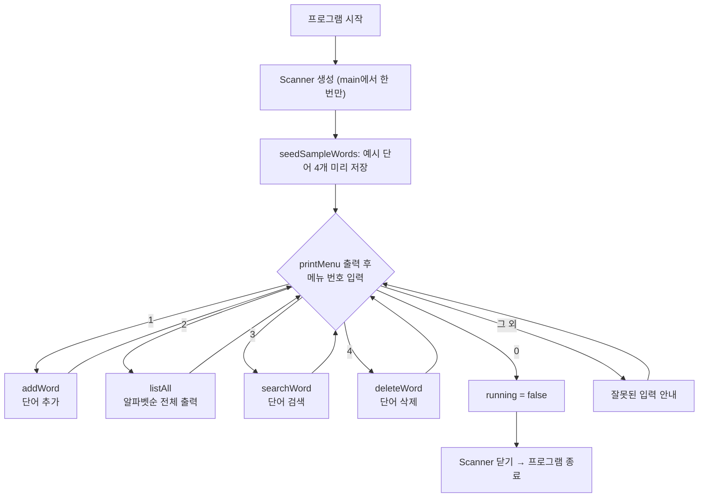
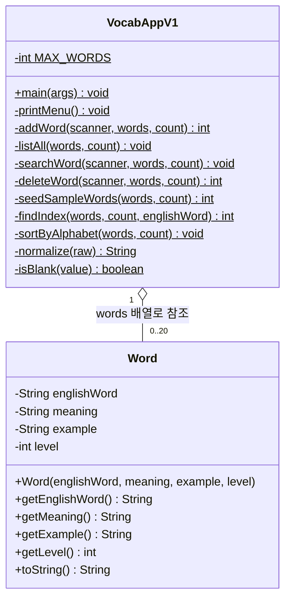

# 미니 단어장 v1 — 구조 해설 & 코드 입력 자료

이 자료는 **강의 2~3주차**(클래스/객체, 배열, 반복문, 예외처리)에 맞춘 콘솔
단어장 v1의 구조를 먼저 설명하고, 뒤에 전체 코드를 실어 학생이 직접 타이핑하며
연습할 수 있도록 만들었습니다.

---

## 1. 무엇을 만드는가

터미널에서 실행되는 영단어장 프로그램입니다. 메뉴 번호를 입력하면 단어를
**추가·조회·검색·삭제**할 수 있고, 등록한 단어는 프로그램을 종료하면 사라집니다
(파일이나 DB에 저장하지 않음 — 저장은 이후 버전(v3)에서 다룹니다).

```
1. 단어 추가       2. 전체 목록 (알파벳순)
3. 단어 검색       4. 단어 삭제
0. 종료
```

## 2. 코드 구조 — 왜 파일이 2개뿐인가

| 파일 | 역할 |
|---|---|
| `Word.java` | 단어 하나(영단어/뜻/예문/난이도)를 표현하는 **클래스** — 데이터 보관 담당 |
| `VocabAppV1.java` | `main()`과 메뉴 기능 — **동작(로직)** 담당 |

아직 패키지, 상속, 컬렉션을 배우기 전이라 파일을 더 잘게 나눌 이유가 없습니다.
"데이터(Word)"와 "그 데이터를 다루는 동작(VocabAppV1)"만 분리한, 가장 단순한
클래스 설계입니다.

**설계 규칙 하나**: `VocabAppV1`의 모든 메서드는 `Scanner`, `Word[] words`,
`int count`를 **매개변수로 주고받습니다.** 아직 인스턴스 필드(객체가 자기
상태를 들고 있는 방식)를 배우기 전이라, "값은 항상 매개변수로 전달한다"는
원칙 하나로 통일했습니다. 특히 `Scanner(System.in)`은 프로그램 전체에서 하나만
만들어 `main()`에서 딱 한 번만 닫습니다 — 여러 개 만들면 입력 버퍼가 꼬이고,
하나를 닫으면 `System.in` 자체가 닫혀서 다른 Scanner도 못 쓰게 되기 때문입니다.

## 3. 프로그램 흐름도



## 4. 클래스 구조



`$` 표시는 `static` 메서드/필드라는 뜻입니다. `VocabAppV1`은 객체를 만들지
않고 `main()`부터 모든 메서드를 `static`으로 바로 호출합니다.

## 5. 주요 멤버 설명

### `Word` — 단어 하나를 표현하는 클래스

| 멤버 | 설명 |
|---|---|
| `englishWord`, `meaning`, `example`, `level` | 생성자에서 한 번 정해지면 바뀌지 않는(`final`) 필드 |
| `Word(...)` 생성자 | 문자열은 공백 제거·소문자 변환 후 저장 |
| `getEnglishWord()` 등 getter | 외부에서 필드 값을 읽는 유일한 방법 (필드는 `private`) |
| `toString()` | 난이도를 "초급/중급/고급" 한글로 바꿔 `"[초급] apple - 사과 (예: ...)"` 형태로 출력 |

### `VocabAppV1` — 실행과 메뉴 로직

| 메서드 | 설명 |
|---|---|
| `main` | Scanner·배열 생성, 예시 단어 등록, 메뉴 반복(`while`) 실행 |
| `printMenu` | 메뉴 화면 출력 |
| `addWord` | 새 단어 입력 → 빈 값/중복 검사 → 난이도 입력(**예외처리**) → 배열에 저장 |
| `listAll` | `sortByAlphabet`로 정렬 후 번호를 붙여 출력 |
| `searchWord` | `findIndex`로 찾은 단어를 출력, 없으면 안내 메시지 |
| `deleteWord` | 찾은 위치부터 뒤 요소를 한 칸씩 당겨서 삭제 |
| `seedSampleWords` | 시작할 때 예시 단어 4개를 배열에 채움 |
| `findIndex` | 영어 단어(정규화 후)가 일치하는 배열 위치를 선형 탐색 |
| `sortByAlphabet` | 선택 정렬(selection sort)로 알파벳순 정렬 |
| `normalize` | 비교 전에 공백 제거 + 소문자 변환 |
| `isBlank` | 문자열이 `null`이거나 공백뿐인지 확인 |

### 예외처리가 등장하는 곳

```java
try {
    level = Integer.parseInt(levelChoice);
} catch (NumberFormatException e) {
    System.out.println("숫자가 아니라서 1) 초급으로 저장합니다.");
    level = 1;
}
```

숫자인지 미리 검사하는 우회 코드 대신, "일단 시도해보고 실패하면 잡는다"는
예외처리 본연의 방식을 `addWord()`에서 처음 연습합니다.

---

## 6. 코드 입력 안내

아래 두 파일의 이름과 코드를 순서대로 그대로 입력하세요. 위에서 이미 구조와
동작을 설명했기 때문에 코드에는 줄별 주석을 넣지 않았습니다.

<div style="page-break-after: always;"></div>

## Word.java

```java
public class Word {

    private final String englishWord;
    private final String meaning;
    private final String example;
    private final int level;

    public Word(String englishWord, String meaning, String example, int level) {
        this.englishWord = englishWord == null ? "" : englishWord.trim().toLowerCase();
        this.meaning = meaning == null ? "" : meaning.trim();
        this.example = example == null ? "" : example.trim();
        this.level = level;
    }

    public String getEnglishWord() {
        return englishWord;
    }

    public String getMeaning() {
        return meaning;
    }

    public String getExample() {
        return example;
    }

    public int getLevel() {
        return level;
    }

    @Override
    public String toString() {
        String levelLabel;
        if (level == 2) {
            levelLabel = "중급";
        } else if (level == 3) {
            levelLabel = "고급";
        } else {
            levelLabel = "초급";
        }

        String base = "[" + levelLabel + "] " + englishWord + " - " + meaning;
        if (!example.isEmpty()) {
            return base + " (예: " + example + ")";
        }
        return base;
    }
}
```

<div style="page-break-after: always;"></div>

## VocabAppV1.java

```java
import java.util.Scanner;

public class VocabAppV1 {

    private static final int MAX_WORDS = 20;

    public static void main(String[] args) {
        Scanner scanner = new Scanner(System.in);
        Word[] words = new Word[MAX_WORDS];
        int count = 0;
        count = seedSampleWords(words, count);

        boolean running = true;
        while (running) {
            printMenu();
            System.out.print("선택: ");
            String choice = scanner.nextLine();

            switch (choice) {
                case "1":
                    count = addWord(scanner, words, count);
                    break;
                case "2":
                    listAll(words, count);
                    break;
                case "3":
                    searchWord(scanner, words, count);
                    break;
                case "4":
                    count = deleteWord(scanner, words, count);
                    break;
                case "0":
                    running = false;
                    break;
                default:
                    System.out.println("잘못된 입력입니다. 메뉴 번호를 다시 선택하세요.");
            }
        }

        System.out.println("프로그램을 종료합니다. (등록된 단어 " + count + "개는 저장되지 않습니다)");
        scanner.close();
    }

    private static void printMenu() {
        System.out.println();
        System.out.println("===== 미니 단어장 (v1) =====");
        System.out.println("1. 단어 추가");
        System.out.println("2. 전체 목록 (알파벳순)");
        System.out.println("3. 단어 검색");
        System.out.println("4. 단어 삭제");
        System.out.println("0. 종료");
    }

    private static int addWord(Scanner scanner, Word[] words, int count) {
        if (count >= words.length) {
            System.out.println("더 이상 추가할 수 없습니다 (최대 " + words.length + "개, 배열이 꽉 찼습니다).");
            return count;
        }

        System.out.print("영어 단어: ");
        String englishWord = scanner.nextLine();
        if (isBlank(englishWord)) {
            System.out.println("단어를 입력하지 않아 취소합니다.");
            return count;
        }
        if (findIndex(words, count, englishWord) != -1) {
            System.out.println("이미 등록된 단어입니다.");
            return count;
        }

        System.out.print("뜻: ");
        String meaning = scanner.nextLine();
        System.out.print("예문 (없으면 그냥 엔터): ");
        String example = scanner.nextLine();

        System.out.println("난이도를 선택하세요. 1) 초급  2) 중급  3) 고급");
        System.out.print("선택: ");
        String levelChoice = scanner.nextLine();

        int level;
        try {
            level = Integer.parseInt(levelChoice);
            if (level < 1 || level > 3) {
                System.out.println("1~3 범위가 아니라서 1) 초급으로 저장합니다.");
                level = 1;
            }
        } catch (NumberFormatException e) {
            System.out.println("숫자가 아니라서 1) 초급으로 저장합니다.");
            level = 1;
        }

        Word word = new Word(englishWord, meaning, example, level);
        words[count] = word;
        count++;
        System.out.println("저장했습니다: " + word);
        return count;
    }

    private static void listAll(Word[] words, int count) {
        if (count == 0) {
            System.out.println("등록된 단어가 없습니다.");
            return;
        }
        sortByAlphabet(words, count);
        for (int i = 0; i < count; i++) {
            System.out.println((i + 1) + ". " + words[i]);
        }
    }

    private static void searchWord(Scanner scanner, Word[] words, int count) {
        System.out.print("검색할 단어: ");
        String key = scanner.nextLine();
        int index = findIndex(words, count, key);
        System.out.println(index != -1 ? words[index].toString() : "등록되지 않은 단어입니다.");
    }

    private static int deleteWord(Scanner scanner, Word[] words, int count) {
        System.out.print("삭제할 단어: ");
        String key = scanner.nextLine();
        int index = findIndex(words, count, key);
        if (index == -1) {
            System.out.println("등록되지 않은 단어입니다.");
            return count;
        }

        for (int i = index; i < count - 1; i++) {
            words[i] = words[i + 1];
        }
        words[count - 1] = null;
        System.out.println("삭제했습니다.");
        return count - 1;
    }

    private static int seedSampleWords(Word[] words, int count) {
        words[count++] = new Word("apple", "사과", "I eat an apple every day.", 1);
        words[count++] = new Word("book", "책", "This book is interesting.", 1);
        words[count++] = new Word("achieve", "성취하다", "She achieved her goal.", 2);
        words[count++] = new Word("ambiguous", "애매한", "The instructions were ambiguous.", 3);
        return count;
    }

    private static int findIndex(Word[] words, int count, String englishWord) {
        String key = normalize(englishWord);
        for (int i = 0; i < count; i++) {
            if (words[i].getEnglishWord().equals(key)) {
                return i;
            }
        }
        return -1;
    }

    private static void sortByAlphabet(Word[] words, int count) {
        for (int i = 0; i < count - 1; i++) {
            int minIndex = i;
            for (int j = i + 1; j < count; j++) {
                if (words[j].getEnglishWord().compareTo(words[minIndex].getEnglishWord()) < 0) {
                    minIndex = j;
                }
            }
            if (minIndex != i) {
                Word temp = words[i];
                words[i] = words[minIndex];
                words[minIndex] = temp;
            }
        }
    }

    private static String normalize(String raw) {
        return raw == null ? "" : raw.trim().toLowerCase();
    }

    private static boolean isBlank(String value) {
        return value == null || value.trim().isEmpty();
    }
}
```

<div style="page-break-after: always;"></div>

## 부록 — 주석 포함 버전 (참고용)

앞의 두 파일과 기능은 완전히 같고, 각 줄 오른쪽에 동작을 설명하는 주석만
추가된 버전입니다. 입력하다가 막히면 참고하세요.

### Word.java (주석 포함)

```java
public class Word {

    private final String englishWord; // 생성 후 바뀌지 않는 영어 단어를 저장한다.
    private final String meaning; // 생성 후 바뀌지 않는 한국어 뜻을 저장한다.
    private final String example; // 생성 후 바뀌지 않는 예문을 저장한다.
    private final int level; // 난이도 숫자를 저장한다. 1=초급, 2=중급, 3=고급

    public Word(String englishWord, String meaning, String example, int level) { // 네 가지 정보로 Word 객체를 만든다.
        this.englishWord = englishWord == null ? "" : englishWord.trim().toLowerCase(); // null은 빈 문자열로, 나머지는 공백 제거 후 소문자로 저장한다.
        this.meaning = meaning == null ? "" : meaning.trim(); // null은 빈 문자열로, 나머지는 공백을 제거해 저장한다.
        this.example = example == null ? "" : example.trim(); // null은 빈 문자열로, 나머지는 공백을 제거해 저장한다.
        this.level = level; // 전달받은 난이도 숫자를 저장한다.
    }

    public String getEnglishWord() { // 저장된 영어 단어를 반환한다.
        return englishWord; // englishWord 필드 값을 호출한 곳에 돌려준다.
    }

    public String getMeaning() { // 저장된 뜻을 반환한다.
        return meaning; // meaning 필드 값을 호출한 곳에 돌려준다.
    }

    public String getExample() { // 저장된 예문을 반환한다.
        return example; // example 필드 값을 호출한 곳에 돌려준다.
    }

    public int getLevel() { // 저장된 난이도 숫자를 반환한다.
        return level; // level 필드 값을 호출한 곳에 돌려준다.
    }

    @Override // Object의 toString() 메서드를 새 표시 형식으로 재정의한다.
    public String toString() { // Word 객체를 문자열로 표시할 형식을 만든다.
        String levelLabel; // 난이도의 한글 표시 이름을 저장할 변수를 선언한다.
        if (level == 2) { // 난이도가 중급인지 확인한다.
            levelLabel = "중급"; // 중급 표시 이름을 저장한다.
        } else if (level == 3) { // 난이도가 고급인지 확인한다.
            levelLabel = "고급"; // 고급 표시 이름을 저장한다.
        } else { // 2와 3이 아닌 난이도인 경우
            levelLabel = "초급"; // 초급 표시 이름을 저장한다.
        }

        String base = "[" + levelLabel + "] " + englishWord + " - " + meaning; // 난이도, 영어 단어, 뜻을 합친 기본 문자열을 만든다.
        if (!example.isEmpty()) { // 예문이 있는지 확인한다.
            return base + " (예: " + example + ")"; // 기본 문자열 뒤에 예문을 붙여 반환한다.
        }
        return base; // 예문이 없으면 기본 문자열만 반환한다.
    }
}
```

<div style="page-break-after: always;"></div>

### VocabAppV1.java (주석 포함)

```java
import java.util.Scanner;

public class VocabAppV1 {

    private static final int MAX_WORDS = 20; // 배열에 저장할 수 있는 단어의 최대 개수

    public static void main(String[] args) { // 프로그램이 시작되는 메서드
        Scanner scanner = new Scanner(System.in); // 키보드 입력을 읽을 Scanner를 만든다.
        Word[] words = new Word[MAX_WORDS]; // 최대 20개 단어를 담을 배열을 만든다.
        int count = 0; // 현재 배열에 저장된 단어 수를 기록한다.
        count = seedSampleWords(words, count); // 예시 단어를 넣고, 늘어난 단어 수를 받는다.

        boolean running = true; // 메뉴 반복을 계속할지 나타내는 값이다.
        while (running) { // running이 true인 동안 메뉴를 반복한다.
            printMenu(); // 사용자에게 메뉴를 출력한다.
            System.out.print("선택: "); // 메뉴 번호 입력을 안내한다.
            String choice = scanner.nextLine(); // 입력한 메뉴 번호를 문자열로 읽는다.

            switch (choice) { // 입력한 메뉴 번호에 맞는 기능을 실행한다.
                case "1": // 단어 추가 메뉴를 선택한 경우
                    count = addWord(scanner, words, count); // 단어를 추가하고 변경된 개수를 받는다.
                    break; // switch문을 끝낸다.
                case "2": // 전체 목록 메뉴를 선택한 경우
                    listAll(words, count); // 저장된 단어를 모두 출력한다.
                    break; // switch문을 끝낸다.
                case "3": // 단어 검색 메뉴를 선택한 경우
                    searchWord(scanner, words, count); // 입력한 단어를 검색한다.
                    break; // switch문을 끝낸다.
                case "4": // 단어 삭제 메뉴를 선택한 경우
                    count = deleteWord(scanner, words, count); // 단어를 삭제하고 변경된 개수를 받는다.
                    break; // switch문을 끝낸다.
                case "0": // 종료 메뉴를 선택한 경우
                    running = false; // while 반복을 끝내도록 값을 바꾼다.
                    break; // switch문을 끝낸다.
                default: // 정의되지 않은 메뉴 번호를 입력한 경우
                    System.out.println("잘못된 입력입니다. 메뉴 번호를 다시 선택하세요."); // 오류 메시지를 출력한다.
            }
        }

        System.out.println("프로그램을 종료합니다. (등록된 단어 " + count + "개는 저장되지 않습니다)"); // 종료 안내를 출력한다.
        scanner.close(); // Scanner가 사용한 입력 자원을 닫는다.
    }

    private static void printMenu() { // 프로그램에서 선택할 수 있는 메뉴를 출력한다.
        System.out.println(); // 메뉴 앞에 빈 줄을 출력한다.
        System.out.println("===== 미니 단어장 (v1) ====="); // 프로그램 제목을 출력한다.
        System.out.println("1. 단어 추가"); // 첫 번째 메뉴를 출력한다.
        System.out.println("2. 전체 목록 (알파벳순)"); // 두 번째 메뉴를 출력한다.
        System.out.println("3. 단어 검색"); // 세 번째 메뉴를 출력한다.
        System.out.println("4. 단어 삭제"); // 네 번째 메뉴를 출력한다.
        System.out.println("0. 종료"); // 종료 메뉴를 출력한다.
    }

    private static int addWord(Scanner scanner, Word[] words, int count) { // 새 단어를 배열에 추가하고 개수를 반환한다.
        if (count >= words.length) { // 배열의 모든 칸을 이미 사용했는지 확인한다.
            System.out.println("더 이상 추가할 수 없습니다 (최대 " + words.length + "개, 배열이 꽉 찼습니다)."); // 추가 불가 이유를 알린다.
            return count; // 기존 단어 수를 그대로 돌려준다.
        }

        System.out.print("영어 단어: "); // 영어 단어 입력을 안내한다.
        String englishWord = scanner.nextLine(); // 입력한 영어 단어를 읽는다.
        if (isBlank(englishWord)) { // 공백만 입력했거나 입력하지 않았는지 확인한다.
            System.out.println("단어를 입력하지 않아 취소합니다."); // 취소 이유를 출력한다.
            return count; // 단어 수를 바꾸지 않고 끝낸다.
        }
        if (findIndex(words, count, englishWord) != -1) { // 같은 영어 단어가 이미 있는지 찾는다.
            System.out.println("이미 등록된 단어입니다."); // 중복 등록을 알린다.
            return count; // 단어 수를 바꾸지 않고 끝낸다.
        }

        System.out.print("뜻: "); // 단어 뜻 입력을 안내한다.
        String meaning = scanner.nextLine(); // 입력한 뜻을 읽는다.
        System.out.print("예문 (없으면 그냥 엔터): "); // 예문 입력을 안내한다.
        String example = scanner.nextLine(); // 입력한 예문을 읽는다.

        System.out.println("난이도를 선택하세요. 1) 초급  2) 중급  3) 고급"); // 선택 가능한 난이도를 보여준다.
        System.out.print("선택: "); // 난이도 번호 입력을 안내한다.
        String levelChoice = scanner.nextLine(); // 입력한 난이도를 문자열로 읽는다.

        int level; // 문자열로 받은 난이도를 숫자로 저장할 변수를 선언한다.
        try { // 숫자가 아닌 입력에서 발생할 예외를 처리한다.
            level = Integer.parseInt(levelChoice); // 난이도 문자열을 int로 변환한다.
            if (level < 1 || level > 3) { // 난이도가 1부터 3 사이인지 확인한다.
                System.out.println("1~3 범위가 아니라서 1) 초급으로 저장합니다."); // 범위를 벗어난 입력을 알린다.
                level = 1; // 유효하지 않은 난이도는 초급으로 정한다.
            }
        } catch (NumberFormatException e) { // 숫자로 변환할 수 없는 입력을 잡는다.
            System.out.println("숫자가 아니라서 1) 초급으로 저장합니다."); // 숫자가 아님을 알린다.
            level = 1; // 숫자가 아니어도 초급으로 정해 계속 진행한다.
        }

        Word word = new Word(englishWord, meaning, example, level); // 입력값으로 Word 객체를 만든다.
        words[count] = word; // 비어 있는 다음 배열 칸에 단어를 저장한다.
        count++; // 저장된 단어 수를 하나 증가시킨다.
        System.out.println("저장했습니다: " + word); // Word의 toString() 결과와 함께 저장을 알린다.
        return count; // 증가한 단어 수를 호출한 곳에 돌려준다.
    }

    private static void listAll(Word[] words, int count) { // 등록된 단어를 알파벳순으로 모두 출력한다.
        if (count == 0) { // 저장된 단어가 하나도 없는지 확인한다.
            System.out.println("등록된 단어가 없습니다."); // 빈 목록 안내를 출력한다.
            return; // 출력할 내용이 없으므로 메서드를 끝낸다.
        }
        sortByAlphabet(words, count); // 저장된 부분만 영어 단어 알파벳순으로 정렬한다.
        for (int i = 0; i < count; i++) { // 첫 단어부터 마지막 저장 단어까지 반복한다.
            System.out.println((i + 1) + ". " + words[i]); // 번호와 단어 정보를 한 줄씩 출력한다.
        }
    }

    private static void searchWord(Scanner scanner, Word[] words, int count) { // 영어 단어로 배열에서 단어를 찾는다.
        System.out.print("검색할 단어: "); // 검색어 입력을 안내한다.
        String key = scanner.nextLine(); // 입력한 검색어를 읽는다.
        int index = findIndex(words, count, key); // 검색어와 일치하는 단어의 배열 위치를 찾는다.
        System.out.println(index != -1 ? words[index].toString() : "등록되지 않은 단어입니다."); // 찾은 단어 또는 실패 메시지를 출력한다.
    }

    private static int deleteWord(Scanner scanner, Word[] words, int count) { // 지정한 단어를 삭제하고 변경된 개수를 반환한다.
        System.out.print("삭제할 단어: "); // 삭제할 단어 입력을 안내한다.
        String key = scanner.nextLine(); // 입력한 단어를 읽는다.
        int index = findIndex(words, count, key); // 삭제할 단어의 배열 위치를 찾는다.
        if (index == -1) { // 해당 단어를 찾지 못했는지 확인한다.
            System.out.println("등록되지 않은 단어입니다."); // 삭제할 수 없는 이유를 출력한다.
            return count; // 단어 수를 바꾸지 않고 끝낸다.
        }

        for (int i = index; i < count - 1; i++) { // 삭제 위치 뒤의 단어들을 한 칸씩 앞으로 옮긴다.
            words[i] = words[i + 1]; // 바로 뒤 단어를 현재 칸으로 복사한다.
        }
        words[count - 1] = null; // 중복된 마지막 칸을 비워 참조를 제거한다.
        System.out.println("삭제했습니다."); // 삭제 완료를 알린다.
        return count - 1; // 삭제 후 하나 줄어든 단어 수를 돌려준다.
    }

    private static int seedSampleWords(Word[] words, int count) { // 시작 화면에 보여 줄 예시 단어를 배열에 넣는다.
        words[count++] = new Word("apple", "사과", "I eat an apple every day.", 1); // 초급 예시 단어를 저장한 뒤 개수를 늘린다.
        words[count++] = new Word("book", "책", "This book is interesting.", 1); // 초급 예시 단어를 저장한 뒤 개수를 늘린다.
        words[count++] = new Word("achieve", "성취하다", "She achieved her goal.", 2); // 중급 예시 단어를 저장한 뒤 개수를 늘린다.
        words[count++] = new Word("ambiguous", "애매한", "The instructions were ambiguous.", 3); // 고급 예시 단어를 저장한 뒤 개수를 늘린다.
        return count; // 예시 단어를 넣은 뒤의 총 단어 수를 반환한다.
    }

    private static int findIndex(Word[] words, int count, String englishWord) { // 영어 단어와 일치하는 배열 위치를 반환한다.
        String key = normalize(englishWord); // 검색어의 공백을 제거하고 소문자로 통일한다.
        for (int i = 0; i < count; i++) { // 저장된 모든 단어를 앞에서부터 확인한다.
            if (words[i].getEnglishWord().equals(key)) { // 현재 단어가 검색어와 일치하는지 확인한다.
                return i; // 일치한 단어의 배열 위치를 즉시 반환한다.
            }
        }
        return -1; // 끝까지 찾지 못했음을 나타내는 값을 반환한다.
    }

    private static void sortByAlphabet(Word[] words, int count) { // 선택 정렬로 단어를 알파벳순으로 정렬한다.
        for (int i = 0; i < count - 1; i++) { // 현재 정렬할 앞쪽 위치를 하나씩 선택한다.
            int minIndex = i; // 가장 앞선 단어의 위치를 현재 위치로 시작한다.
            for (int j = i + 1; j < count; j++) { // 현재 위치 뒤의 단어들을 비교한다.
                if (words[j].getEnglishWord().compareTo(words[minIndex].getEnglishWord()) < 0) { // 더 알파벳순으로 앞선 단어인지 확인한다.
                    minIndex = j; // 더 앞선 단어의 위치를 기억한다.
                }
            }
            if (minIndex != i) { // 가장 앞선 단어가 현재 위치와 다른지 확인한다.
                Word temp = words[i]; // 현재 위치의 단어를 임시 변수에 보관한다.
                words[i] = words[minIndex]; // 가장 앞선 단어를 현재 위치로 옮긴다.
                words[minIndex] = temp; // 보관한 단어를 원래 가장 앞선 위치로 옮긴다.
            }
        }
    }

    private static String normalize(String raw) { // 비교하기 쉽도록 문자열 형식을 통일한다.
        return raw == null ? "" : raw.trim().toLowerCase(); // null은 빈 문자열로, 나머지는 공백 제거 후 소문자로 바꾼다.
    }

    private static boolean isBlank(String value) { // 문자열이 없거나 공백뿐인지 확인한다.
        return value == null || value.trim().isEmpty(); // null이거나 공백 제거 후 빈 문자열이면 true를 반환한다.
    }
}
```
